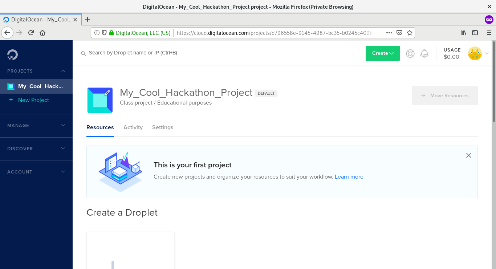
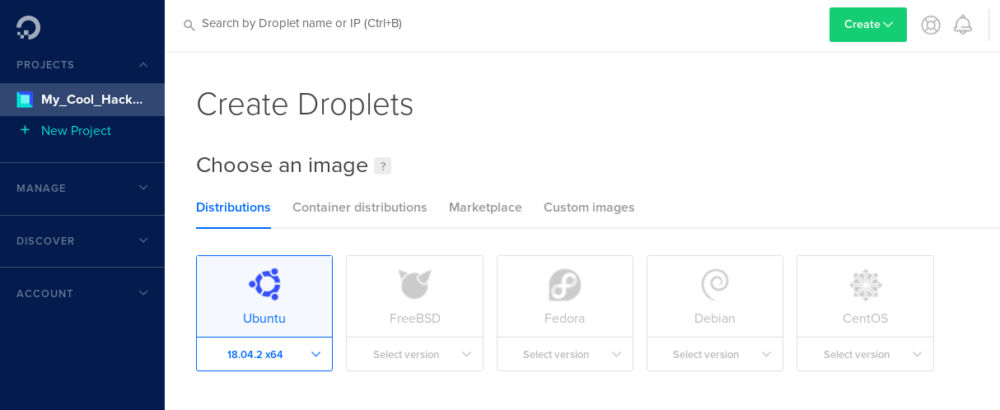
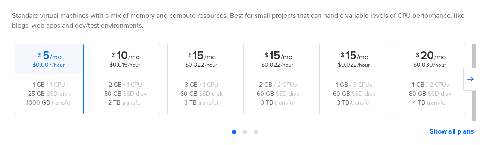
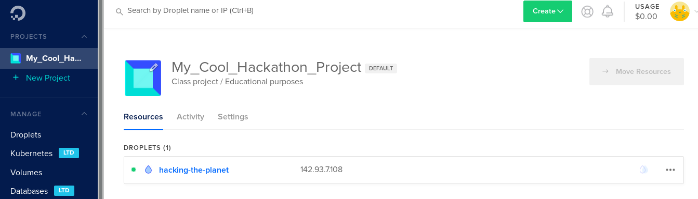

In order to get your website deployed, you will need to create and configure a machine to do that. This page has all the information you need to create and configure a Digital Ocean droplet to host your website.
_Note:_ you are welcome to use any cloud provider you are comfortable with. Setting up a machine on Digital Ocean is fast and easy, but you can use AWS, Azure, or any other service provider you prefer. Please note that the technical advisors at the hackathon may not be able to help you troubleshoot account issues for the provider you choose to go with.

## Step 0: Create an Account on Digital Ocean

- Create an account on [Digital Ocean](https://cloud.digitalocean.com/registrations/new). You will need three pieces of information to register:
  - Your name (individual or team name)
  - A valid email address
  - A password for your account
- You will receive a confirmation email after registering; click the confirmation link to finalize account creation.
- After clicking the confirmation link, you will be taken to a billing page. Please have a credit or debit card ready to link to your new account. _Note: this is a common requirement for all service providers; note that you can suspend services to limit your charges at any time._
- Next, you will be prompted to create a project. 
  - Make sure you give your project a sweet name! 
  - For the **What is your project for?** question, you can select whichever category you prefer. We recommend _Class project / Educational purposes_, but you may prefer _Web Application_, _Website or blog_, _Service or API_, or _Other_.
  - For the deployment tools section of this page, you can select anything you know you will be using; when in doubt, skip this step.
  - At the bottom of the page, change the slider to reflect how many people are on your team.
- TODO :bug: :bug: :bug: address adding credits to account (if we end up doing this)

## Step 1: Create Your Digital Ocean Droplet

A **Droplet** is a fancy term Digital Ocean (DO) came up with; fundamentally, it is a remote machine that they provide hardware and infrastructure for. A droplet that you create can be used to deploy websites, run bots, build and run large projects, or anything else you want. 

Digital Ocean droplets are scalable -- if or when you need more (or less) computational resources, you can change the specifications of your droplet in your DO account management page.

To create your first droplet, follow these steps:

- Log into your brand-new DO account and navigate to your project dashboard. Your dashboard should look something like this:
  
- Scroll down a little and click "Create Droplet".
- The next page will have settings for your new droplet.
  - **Choose an operating system.** The DO menu defaults to Ubuntu, and we recommend using Ubuntu. You are welcome to use any distribution you prefer, but Ubuntu is easy (and the technical advisors at the hackathon will have an easier time helping you with configuration if you need help).
    
  - **Choose a pricing plan.** The DO menu defaults to a pricing plan of $40.00 per month. We recommend picking a more affordable plan. Click the _left arrow_ to see cheaper plans. The $5.00 per month plan features 25GB of disk storage and 1GB of RAM; this will most likely be more than enough for your project.
    
  - **Choose extra options.** DO offers backups for your machine at an extra cost; feel free to ignore this option (especially if you are using version control on your project). Likewise, feel free to ignore the "Add block storage" option unless you feel you will need more disk space for your project.
  - **Choose a datacenter region.** Feel free to choose a region that speaks to you personally. Leaving the default setting as-is should be perfectly fine.
  - **Add SSH keys.** Skip this step for now; SSH keys will be discussed later in this tutorial.
  - **Final steps.** 
    - For the _How many Droplets?_ question, leave the existing selection (1 Droplet) as is unless you explicitly need multiple machines.
    - For the _Choose a hostname_ section, pick a sweet computer name! You can leave it on the default setting, but who wants a computer name like `ubuntu-s-1vcpu-1gb-nyc1-01`?
    - For the _Select project_ section, make sure your project name is selected.
  - Click _Create_.

When the droplet has been created, your Project Dashboard will show the droplet with the hostname you picked and the droplet's IP address.

