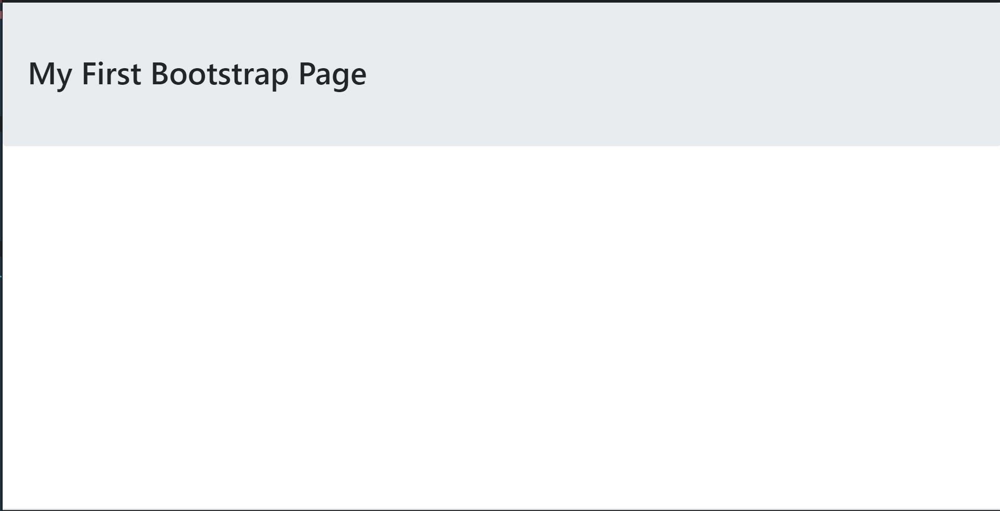

# Styling Your Website to Be Responsive

Responsive web design is the practice of using HTML and CSS to automatically resize and re-orient the contents of a webpage to fit on smaller screen resolutions. There are several different methods of acheiving a responsive webpage.

## Viewport

The viewport is the part of the webpage that's currently visible to the user. Viewports vary between different devices,
as the screen size between devices also varies. For example, the viewport of a desktop monitor will be significantly larger than the viewport of
a mobile device.

The viewport can be controlled by setting a `<meta>` tag in each web page you'd like to make responsive. The following is an example of how to use this tag (it should be added somewhere in your `<head>` element):

```html
<meta name="viewport" content="width=device-width, initial-scale=1.0" />
```

`width=device-width` sets the width of the viewport to match the width of the device. This is useful for devices (such as mobile devices) that have less width compared to the height of the device.

`initial-scale` sets the zoom factor of the viewport to the value of the scale provided. We set this to `1.0` to set it as the default zoom for the viewport when the webpage is first loaded.

## Mobile-First Design

Mobile-first design refers to the practice of designing your website for mobile devices before designing your website for desktop devices.

A good methodology for this is to design your website to work on smaller screens, and then add additional styling for larger screen resolutions via `Media Queries`.

## Media Queries

A Media query is a way to add additional CSS styling based on the given condition of the query.

The query follows the `@media` syntax, followed by the condition on which it should apply the additional CSS, followed by the additional CSS to be applied.

The following example changes the background color of the body to black
when the browser window's width is 600px or smaller.

```css
@media only screen and (max-width: 600px) {
  body {
    background-color: black;
  }
}
```

The `only` portion of the syntax is used to prevent older browsers that don't support media queries with media features from applying the styles, and does not affect modern browsers.

The `screen` specifies the media type to be used (in this example, it specifies computer screens, mobile devices, etc).

The `and` combines the media feature with the media type, which in the above example it is utilizing the `max-width` media feature.

## Images

An image's CSS can be set to scale up or down depending on the width or height of the device. This can be acheived via the following example:

```css
img {
  width: 100%;
  height: auto;
}
```

## Grid View

A grid view is a way to organize the layout of your webpage based on responsive columns.

To learn more about this, click [here](https://www.w3schools.com/css/css_rwd_grid.asp)

## Frameworks

One of the most popular css frameworks to use is Bootstrap. Bootstrap combines html, css, and jquery to make responsive web components and thus, responsive webpages.

It can be included via CDN and can be integrated into nearly any part of your webpage.

```html
<!DOCTYPE html>
<html lang="en">
  <head>
    <!-- Required meta tags -->
    <meta charset="utf-8" />
    <meta
      name="viewport"
      content="width=device-width, initial-scale=1, shrink-to-fit=no"
    />

    <!-- Bootstrap CSS -->
    <link
      rel="stylesheet"
      href="https://stackpath.bootstrapcdn.com/bootstrap/4.3.1/css/bootstrap.min.css"
      integrity="sha384-ggOyR0iXCbMQv3Xipma34MD+dH/1fQ784/j6cY/iJTQUOhcWr7x9JvoRxT2MZw1T"
      crossorigin="anonymous"
    />

    <!-- Optional JavaScript -->
    <!-- jQuery first, then Popper.js, then Bootstrap JS -->
    <script
      src="https://code.jquery.com/jquery-3.3.1.slim.min.js"
      integrity="sha384-q8i/X+965DzO0rT7abK41JStQIAqVgRVzpbzo5smXKp4YfRvH+8abtTE1Pi6jizo"
      crossorigin="anonymous"
    ></script>
    <script
      src="https://cdnjs.cloudflare.com/ajax/libs/popper.js/1.14.7/umd/popper.min.js"
      integrity="sha384-UO2eT0CpHqdSJQ6hJty5KVphtPhzWj9WO1clHTMGa3JDZwrnQq4sF86dIHNDz0W1"
      crossorigin="anonymous"
    ></script>
    <script
      src="https://stackpath.bootstrapcdn.com/bootstrap/4.3.1/js/bootstrap.min.js"
      integrity="sha384-JjSmVgyd0p3pXB1rRibZUAYoIIy6OrQ6VrjIEaFf/nJGzIxFDsf4x0xIM+B07jRM"
      crossorigin="anonymous"
    ></script>

    <title>Bootstrap Example Page</title>
  </head>
  <body>
    <div class="jumbotron"><h1>My First Bootstrap Page</h1></div>
  </body>
</html>
```

Output of the following code


If you'd like to see working bootstrap examples, visit [here](https://getbootstrap.com/docs/4.3/examples/)
# References

- [Responsive Web Design](https://www.w3schools.com/css/css_rwd_intro.asp)
- [Media Queries](https://www.w3schools.com/cssref/css3_pr_mediaquery.asp)
- [Responsive Images](https://www.w3schools.com/css/css_rwd_images.asp)
- [Viewport](https://www.w3schools.com/css/css_rwd_viewport.asp)
- [Frameworks](https://www.w3schools.com/css/css_rwd_frameworks.asp)
- [Bootstrap](https://getbootstrap.com/docs/4.3/getting-started/introduction/)
